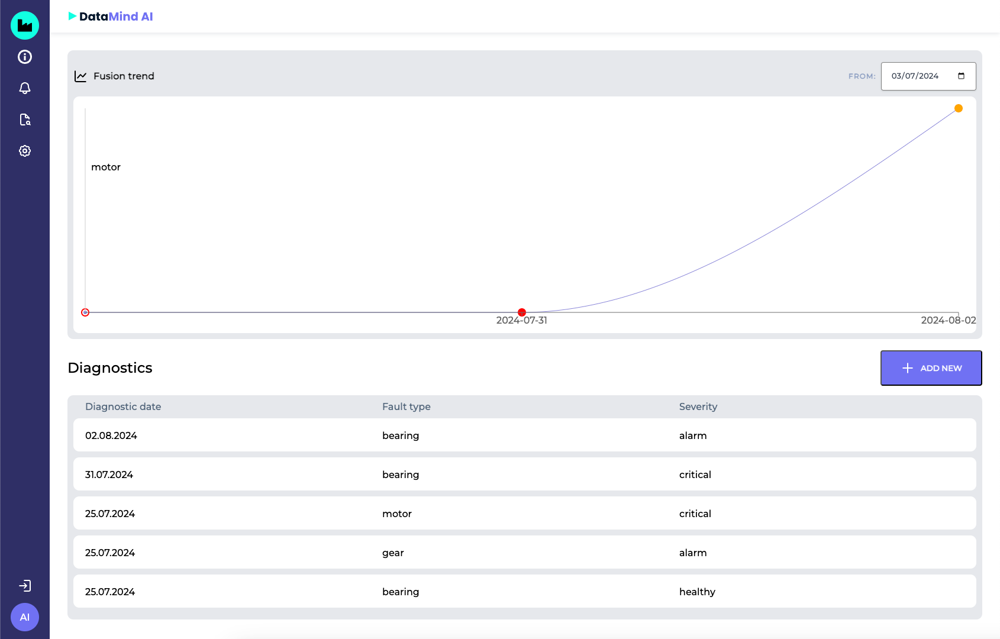

# DataMind project

Tracking system to healthcheck the machines.

This is a pet project to practice full stack skills:

- Frontend: React.js
- Backend: FastAPI

## Functionality
- Authorization.
- Track healthcheck insights.
- Insights filtration.
- Chart visualization.

## UI
